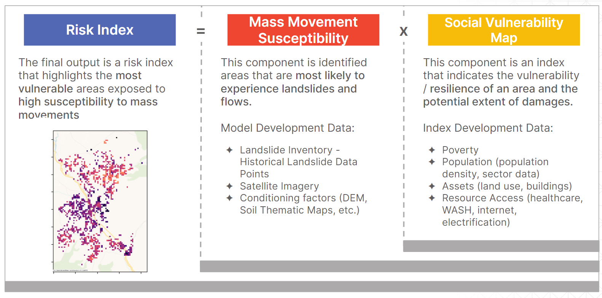
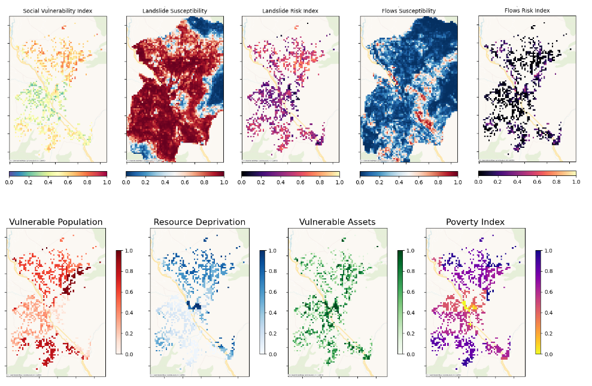

<div align="center">

# iMMAP EVIDEM Mass Movement Risk Mapping

</div>

<a href="https://www.python.org/"></a>
<a href="https://black.readthedocs.io/en/stable/"></a>

<br/>
<br/>


# 📜 Description

The iMMAP Evidem project aims to calculate the overall risk of selected target municipalities by combining the susceptibility and the social vulnerability index. This github repository contains the generation and development of the susceptibility model and the social vulnerability index.

### Project Overview

<br/>
### Sample Output Maps



> Before jumping into running these notebooks, make sure to follow and execute the sections below. It is advised to set up the local environment to properly run the notebooks.

<br/>
<br/>


# ⚙️ Local Setup for Development

This repo assumes the use of [conda](https://docs.conda.io/en/latest/miniconda.html) for simplicity in installing GDAL.


## Requirements

1. Python 3.9
2. make
3. conda


## 🐍 One-time Set-up
Run this the very first time you are setting-up the project on a machine to set-up a local Python environment for this project.

1. Install [miniconda](https://docs.conda.io/en/latest/miniconda.html) for your environment if you don't have it yet.
```bash
wget https://repo.anaconda.com/miniconda/Miniconda3-latest-Linux-x86_64.sh
bash Miniconda3-latest-Linux-x86_64.sh
```

2. Create a local conda env and activate it. This will create a conda env folder in your project directory.
```
make conda-env
conda activate ./env
```

3. Run the one-time set-up make command.
```
make setup
```

## 📥 Input Data Location and Notebook Order
The notebooks in this repository read files from a specified location in the `data/` folder. To run these notebooks, we recommend to download the input data from the provided GDrive and place them in the location specified by each notebook. We provide input datasets for the starting notebooks in `01_susceptibility_model/` and `02_index_calculation/`.

Folders and notebooks are also prefixed by a number (i.e. `01_create_training_data_coordinate_labels.ipynb`, `02_feature_engineering.ipynb`, etc.) that indicate their intended order of execution. These notebooks should be run in sequence.

## 📦 Dependencies

Over the course of development, you will likely introduce new library dependencies. This repo uses [pip-tools](https://github.com/jazzband/pip-tools) to manage the python dependencies.

There are two main files involved:
* `requirements.in` - contains high level requirements; this is what we should edit when adding/removing libraries
* `requirements.txt` - contains exact list of python libraries (including depdenencies of the main libraries) your environment needs to follow to run the repo code; compiled from `requirements.in`


When you add new python libraries, please do the ff:

1. Add the library to the `requirements.in` file. You may optionally pin the version if you need a particular version of the library.

2. Run `make requirements` to compile a new version of the `requirements.txt` file and update your python env.

3. Commit both the `requirements.in` and `requirements.txt` files so other devs can get the updated list of project requirements.

Note: When you are the one updating your python env to follow library changes from other devs (reflected through an updated `requirements.txt` file), simply run `pip-sync requirements.txt`

<br/>
